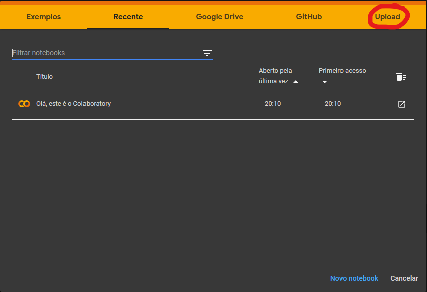
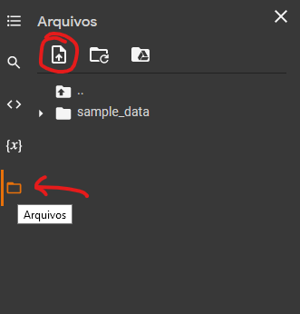

 

 

 

  

  <h3 align="center">RMS Titanic</h3>

  

    Em 10 de Abril de 1912 inicia-se a primeira e última viajem do maior e mais luxuoso navio de passageiros da época, o RMS Titanic. Com mais de 269 metros de comprimento e mais de 46 mil toneladas, era operado pela White Star Line e tinha a lenda de ser supostamente "inafundável". Porém ele nunca chegou ao seu destino final em Nova Yorque pois em 14 de Abril de 1912, colidiu com um imenso iceberg e na madrugada do dia seguinte naufragou nas águas geladas do oceâno Atlântico, dando origem a mais conhecida trajédia marítma até o momento.
      

## Motivação

    Para estudar algumas ferramentas da área da ciência de dados, utilizei um data set disponibilizado pela equipe da <a href="https://udacity.com">Udacity</a>, que contém informações reais sobre uma parte dos passageiros à bordo do RMS Titanic no dia da     tragédia, para realizar uma análise básica.

## Instruções

    Utilizei o  como ferramenta para o desenvolvimento do código e comentários para situar o leitor, porém o próprio github tem uma ferramenta para visualizar arquivos do tipo .ipynb, que são arquivos de notebooks python, bastando apenas clicar no arquivo <a href="https://github.com/denisAlberto/AnaliseExploratoriaTitanic/blob/main/EstudoTitanic.ipynb/">"EstudoTitanic.ipynb"</a> para visualizá-lo.
      
    Caso queira utilizar o Google Colab, primeiramente baixe o projeto em seu computador com o comando utilizando o git bash:

    git clone https://github.com/denisAlberto/AnaliseExploratoriaTitanic.git
    

    basta entrar logado em uma conta google no site , e em seguida clicar em upload como mostra a imagem abaixo:  

    
     
    figura 1 - Upload python notebook
      

    Após isso, selecione o arquivo <a href="https://github.com/denisAlberto/AnaliseExploratoriaTitanic/blob/main/EstudoTitanic.ipynb/">"EstudoTitanic.ipynb"</a> e realize o upload para sua conta.
     
    Também será necessário realizar o upload do dataset <a href="https://github.com/denisAlberto/AnaliseExploratoriaTitanic/blob/main/titanic.data">"titanic.data"</a> que contém os dados que utilizei para a análise. Portanto na aba lateral esquerda, encontre o icone de pasta "arquivos", em seguida clique no icone de upload, e depois encontre o arquivo <a href="https://github.com/denisAlberto/AnaliseExploratoriaTitanic/blob/main/titanic.data">"titanic.data"</a> na pasta do projeto em seu computador para realizar o upload.
      

    
     
    figura 2 - Upload titanic.data
      

Com o dataset adicionado, segure Ctrl+F9 para rodar os comandos python do notebook e gerar as tabelas e gráficos da análise.
  

 
## Licença

Distribuído sob a licença MIT. Veja `LICENÇA` no topo da página para mais informações.

 

## Obrigado
